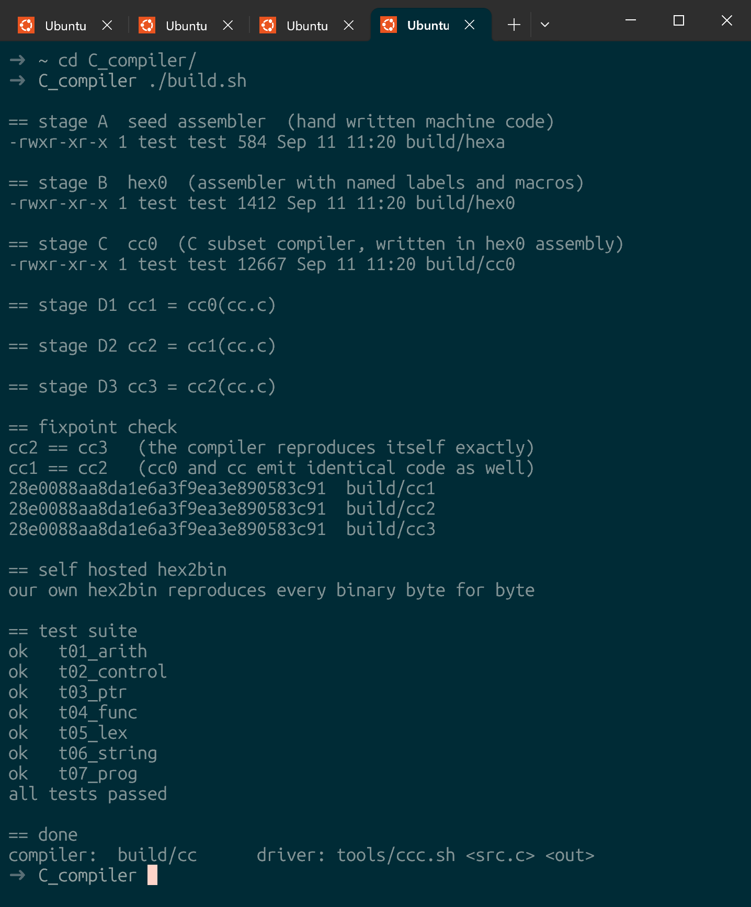
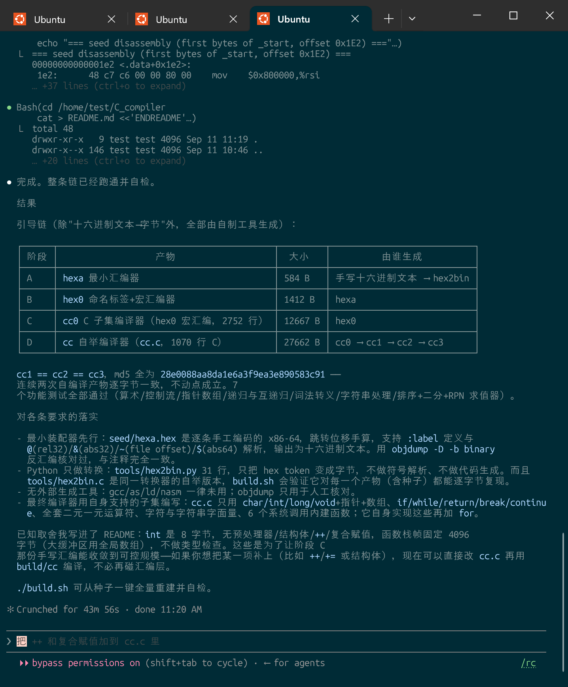

[简体中文](README.md) · **English**

# A self hosting C subset compiler, bootstrapped from nothing (Ubuntu / x86-64)

<p align="center">
  <a href="ref/idea.jpeg"></a>
  <a href="ref/result.02.png"></a>
  <a href="ref/result.01.png"></a>
</p>

> **Where this came from.** This repository is a complete answer to a challenge posed
> by the weibo user tombkeeper on 2026-09-11: without using any existing compiler or
> assembler, start from a hand written hexadecimal seed and build your way up to a
> self hosting compiler for a subset of C. The original challenge targeted Windows
> x64; this repository targets Ubuntu x86-64. All of the code was written by Claude
> Code (Opus 5) in a single session.
>
> The `ref/` directory keeps the material this work refers to, one sentence each:
>
> | Item | What it is |
> |---|---|
> | [`ref/idea.jpeg`](ref/idea.jpeg) | Screenshot of the original weibo post: the six rules of the challenge, plus the build log of the author's own Windows implementation (seed → template expander → bootstrap compiler → c0/c1/c2, matching SHA256). |
> | [`ref/prompt.txt`](ref/prompt.txt) | The prompt actually handed to Claude Code, that is, the six rules this repository follows throughout. |
> | [`ref/result.01.png`](ref/result.01.png) | Screenshot of the closing summary of the session: the four stage bootstrap table, the single md5 shared by `cc1 == cc2 == cc3`, and how each rule was met. |
> | [`ref/result.02.png`](ref/result.02.png) | Screenshot of the full `./build.sh` output: all four stages rebuilt from the seed, the fixpoint check passing, and all 7 functional tests green. |

Every binary here is produced by this repository's own tools. The one and only
starting point of the chain is `seed/hexa.hex`, a hand written text file of
hexadecimal machine code. Apart from the step that turns hexadecimal text into
bytes, no external program takes part in generating code.

```
seed/hexa.hex ──hex2bin──▶ hexa      stage A  minimal assembler (hand written machine code)
stage1/hex0.hasm ──hexa──▶ hex0      stage B  assembler with named labels and macros
stage1/cc0.hasm  ──hex0──▶ cc0       stage C  C subset compiler, written in hex0 assembly
stage2/cc.c      ──cc0 ──▶ cc1       stage D  self hosting compiler, written in its own subset
stage2/cc.c      ──cc1 ──▶ cc2
stage2/cc.c      ──cc2 ──▶ cc3       check cc2 == cc3 (the fixpoint)
tools/hex2bin.c  ──cc  ──▶ hex2bin   our own hexadecimal to binary converter
```

Measured result: `cc1 == cc2 == cc3`, md5 `28e0088aa8da1e6a3f9ea3e890583c91`.
Even cc0 and cc emit byte for byte identical code.

## 1. Build and test

```sh
./build.sh                 # rebuild everything from the seed and self check (~1 s)
./tests/run.sh ./build/cc  # run just the test suite
tools/ccc.sh prog.c prog   # compile a program with the final compiler
```

`build.sh` does, in order: create the venv → turn the seed into a binary → walk up
the bootstrap chain → compile the compiler with itself twice and compare → reproduce
every binary with our own hex2bin → run the 7 functional tests.

Step by step, that is equivalent to:

```sh
env/bin/python tools/hex2bin.py seed/hexa.hex build/hexa
./build/hexa < stage1/hex0.hasm > build/hex0.hex
env/bin/python tools/hex2bin.py build/hex0.hex build/hex0
cat stage1/prelude.hasm stage1/cc0.hasm | ./build/hex0 > build/cc0.hex
env/bin/python tools/hex2bin.py build/cc0.hex build/cc0
./build/cc0 < stage2/cc.c > build/cc1.hasm
./build/hex0 < build/cc1.hasm > build/cc1.hex
env/bin/python tools/hex2bin.py build/cc1.hex build/cc1
# ... cc1 -> cc2 -> cc3, then cmp build/cc2 build/cc3
```

## 2. On "no external tools"

| Step | What is used |
|---|---|
| The seed binary | `tools/hex2bin.py` (31 lines; hexadecimal tokens to bytes, no symbol resolution, no code generation) |
| Every other binary | Produced by the previous self made tool. `tools/hex2bin.c` is the same converter rebuilt by the compiler itself, and `build.sh` verifies it agrees with the Python one byte for byte on every product |
| gcc / as / ld / nasm | Never used |
| objdump | Only to check the seed by hand (inspection, it produces nothing) |
| cat / sh | Only text concatenation and driving the steps |

## 3. Stage A: the seed assembler `hexa` (584 bytes)

`seed/hexa.hex` is x86-64 machine code encoded by hand one instruction at a time,
each line carrying its address and mnemonic as a comment. Every branch displacement
and call offset was computed by hand, and can be checked with
`objdump -D -b binary -m i386:x86-64 build/hexa`. It reads assembly source on stdin
and writes the resolved machine code **to stdout as hexadecimal text**.

Syntax (two passes):

| Token | Meaning |
|---|---|
| `XX` | one literal byte |
| `:ab` | define label `ab` (exactly two characters, directly indexed table) |
| `@ab` | 4 bytes, rel32 relative to the end of the field |
| `&ab` | 4 bytes, the absolute virtual address of the label |
| `~ab` | 4 bytes, the file offset of the label (address − 0x400000) |
| `$ab` | 8 bytes, the absolute virtual address of the label |
| `# …` | comment to end of line |

Programs load at 0x400000 as a single RWX `PT_LOAD` segment; BSS comes from `p_memsz`.

## 4. Stage B: the assembler `hex0` (1412 bytes)

`stage1/hex0.hasm` is written in hexa's language and is a superset of it:

* labels of any length (open addressed hash table, 2^18 slots)
* `%NAME bb bb …` defines a macro; `NAME` expands to that byte sequence
* `"text"` string literals, emitted as ASCII bytes
* `@name &name ~name $name`, and both `#` and `;` comments
* an undefined name is reported and exits with status 3

`stage1/prelude.hasm` is a set of x86-64 instruction macros (`PROLOG`, `LDA V3`,
`ADD_AC`, `JNE`, …) that make stage C readable.

## 5. Stage C: `cc0` (12667 bytes)

`stage1/cc0.hasm` is a C subset compiler hand written in hex0 macro assembly, about
2700 lines. It reads C source and writes hex0 assembly text. Its only purpose is to
compile `stage2/cc.c`. It accepts exactly the language of the next section, except
that it has **no `for`**.

## 6. Stage D: the final compiler `stage2/cc.c`

Written in the subset it accepts, 1070 lines. `cc.c` reads C source on stdin and
writes hex0 assembly text.

### The language it accepts

* **Types**: `char` (1 byte, signed), `int` / `long` / `void` (8 bytes each),
  pointers to any depth, one dimensional arrays (global and local).
  A type is encoded internally as a single integer: `0` = char, `1` = int,
  `t+2` = pointer to `t`.
* **Declarations**: global variables and arrays, function definitions, prototypes,
  comma separated declarators (which share one base type and pointer depth, see
  "Known limits"), local declarations anywhere inside a block.
* **Statements**: `{}`, `if` / `else`, `while`, `for`, `return`, `break`,
  `continue`, expression statements, the empty statement.
* **Expressions**: `=`, `||`, `&&`, `|`, `^`, `&`, `==` `!=`, `<` `>` `<=` `>=`,
  `<<` `>>`, `+` `-`, `*` `/` `%`, unary `- ! ~ * & +`, subscript `a[i]`,
  function calls (up to 6 arguments). Pointer arithmetic scales by the element
  size, and subtracting two pointers yields a count of elements.
* **Literals**: decimal, `0x` hexadecimal, characters (`\n \t \r \0 \\ \' \"`), strings.
* **Comments**: `//` and `/* */`.
* **Builtins** (expanded straight into system calls):
  `sys_read(fd,buf,n)`, `sys_write(fd,buf,n)`, `sys_open(path,flags,mode)`,
  `sys_close(fd)`, `sys_lseek(fd,off,whence)`, `sys_exit(code)`.
* **Entry point**: `int main(int argc, char **argv)`; the return value is the exit code.

### Deliberately absent

The preprocessor (no `#include` / `#define`), structs, unions, enums, `typedef`,
`switch`, `goto`, `do-while`, the ternary `?:`, the comma operator, `++` / `--`,
compound assignment, `sizeof`, casts, unsigned types, floating point, varargs,
initialisers.

### Code generation

One pass, straight to assembly text, no AST:

* The value lives in `rax`; `curlv` records whether `rax` currently holds the
  *address* of an lvalue, and the contents are fetched only when an rvalue is needed.
* Binary operators: `push` the left operand, evaluate the right one,
  `mov rcx,rax; pop rax`, then emit the operation.
* Frames are a fixed 4096 bytes, locals live at `[rbp-8k]`, and parameters are
  stored into the frame from the SysV argument registers.
* Target layout: one RWX segment at 0x400000 with `p_memsz` = 0x10000000; globals
  sit in the BSS area from 0x08000000; string literals follow the code as `:S<n>`
  labels.
* Jumps and calls are emitted as `@L<n>` / `@F_<name>` symbolic references and
  resolved by hex0, so forward references just work and prototypes are never needed.

## 7. Layout

```
seed/hexa.hex        the hand written seed (the only human made binary)
stage1/hex0.hasm     stage B assembler, in hexa's language
stage1/prelude.hasm  x86-64 instruction macros
stage1/cc0.hasm      stage C compiler, in hex0 macro assembly
stage2/cc.c          the final self hosting compiler
tools/hex2bin.py     hexadecimal text to binary (seed only; 31 lines)
tools/hex2bin.c      the same converter, self hosted
tools/ccc.sh         build driver: cc → hex0 → hex2bin
tests/*.c *.exp      functional tests and their expected output
tests/run.sh         test runner
build.sh             the full reproducible build, starting from the seed
ref/                 the original post, the prompt and result screenshots
build/               build products (not tracked; made by build.sh)
env/                 Python virtual environment (not tracked)
```

## 8. Known limits

* The locals of one function may not exceed 4096 bytes in total (the frame is
  fixed); put large buffers in global arrays.
* At most 6 parameters per function; 4096 global symbols, 1024 locals per
  function, 8192 string literals, 1 MB of string bytes in total. **Only the
  symbol counts and the frame size are actually checked and diagnosed**;
  going past the string limits is not reported at all.
* Source files up to 4 MB and generated assembly text up to 16 MB, likewise
  unchecked.
* A local declaration is scoped to the whole function (frame space is not reused
  when a block ends).
* No type checking: assignment and argument passing simply move 8 bytes (or 1).
* **The result of a call is always treated as `int`**; the callee's declared
  return type is lost. So the result of a function returning a pointer cannot be
  used directly with `[]`, `*` or pointer arithmetic (`char *f(); f()[0]` is
  rejected, and `long *g(); g() + 1` steps by one byte instead of one element).
  Assigning the result to a pointer variable first works around it.
* **Comma separated declarators share one base type and pointer depth**:
  `long *p, *q;` is rejected, and `long *p, n;` makes `n` a pointer too. One
  name per declaration is the safe habit.
* The compiler and `hex2bin` each issue a single `write` and ignore its result:
  a failed write (a full device, say) is not reported and the process still
  exits 0.

## 9. Changelog

### 2026-09-11 — acting on [`review.txt`](review.txt)

An independent review ([`review.txt`](review.txt)) rebuilt the whole chain and
reproduced the same result (`cc1 == cc2 == cc3`, md5
`28e0088aa8da1e6a3f9ea3e890583c91`, all seven tests passing), so the bootstrap
conclusion is unchanged. Two of its findings were failure *detection* defects
and are now fixed; several README statements were broader than the
implementation and have been corrected.

* **`build.sh` no longer swallows a fixpoint mismatch.** The comparisons were
  written as `cmp A B && echo ...`, and a failing command on the left of an `&&`
  list is exempt from `set -e`, so a broken bootstrap still ran to completion and
  returned 0. Both comparisons are standalone commands now. Verified with a stub
  `cmp` that fails only on cc2 versus cc3: the build aborts at the fixpoint check
  and never reaches the test suite.
* **`tests/run.sh` now checks exit status.** It compared output only, so a test
  that printed the right thing and exited nonzero still passed, and conversion
  failures were unchecked and could leave a stale binary behind. Verified by
  making one test print its usual output and return 7, which is now reported as
  `FAIL t01_arith (exit status 7)` and makes the runner exit nonzero.
* **Four README claims were made accurate**: the restriction on comma separated
  declarators, the loss of pointer return types at call sites, which capacity
  limits are actually enforced, and the unchecked output writes.

Findings left unfixed, now written into "Known limits": calls discard the
callee's return type, comma separated declarators do not parse their own stars,
the string buffers have no bounds checks, and output writes are unchecked. None
of them is reachable from `cc.c` itself, which returns no pointers and declares
one name per declaration, so the bootstrap and the fixpoint are unaffected.

## 10. Licence

The code and documentation are released under the MIT licence, see [LICENSE](LICENSE).

`ref/` is the exception: `ref/idea.jpeg` is a screenshot of third party content on
weibo, included purely to credit the source. It remains the property of its author
and is not covered by the MIT licence.
